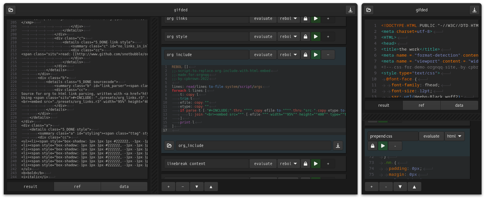

# gifded
Process stuff by daisychaining Rebol3, Python and Shell-scripts... whatever works.  
Quickly cache, bypass, reorder scripts.  
Save and load projects as an orgfile, cause shizzas & gizzas...  
Which has since led me down the rabbithole of making a branching org-based process editor.  
Org without the old-man-cock (emacs) would be great...  
So probably no more updates to this program.

# usage
- do not use this program, its here for display only

# notes
- `lz4 -d install.tar.lz4 | tar xvf -`
- `clear && valac gifded.vala --pkg gtk4 --pkg gtksourceview-5 -X -lm`

# screenie

