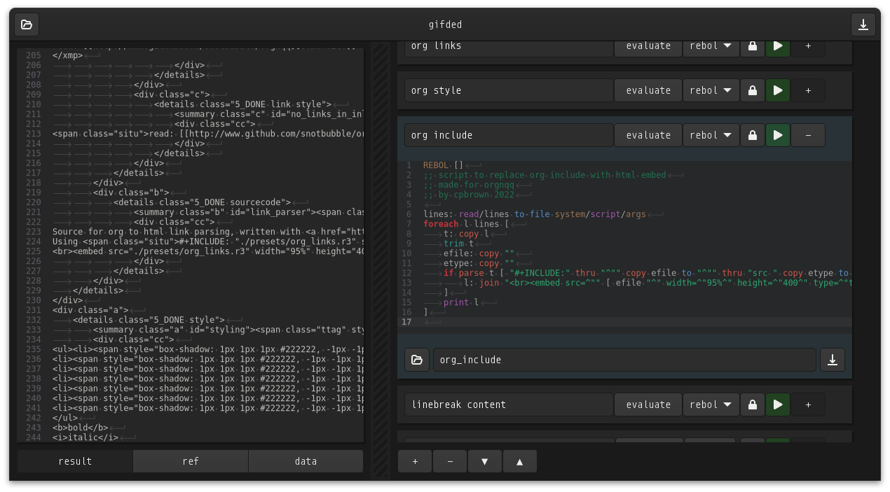

# gifded
Get It Fucking Done EDitor  

- process stuff by daisychaining Rebol3, Python and Shell-scripts... whatever works  
- quickly cache, bypass, reorder scripts  
- save and load projects as an orgfile, cause shizzas & gizzas...  

# usage
- do not use this program, its here for demonstration purposes only

# testing
- copy contents of install to home, to get syntax highlighting for Rebol & Org
- grab a release of [Rebol3](https://github.com/Oldes/Rebol3/releases/tag/3.9.0), copy to your project dir, rename it to `r3`
- download gifded to the project dir
- run `clear && valac gifded.vala --pkg gtk4 --pkg gtksourceview-5 -X -lm`
- install whatever the above complains about until it works
- run `./gifded`

# screenie

